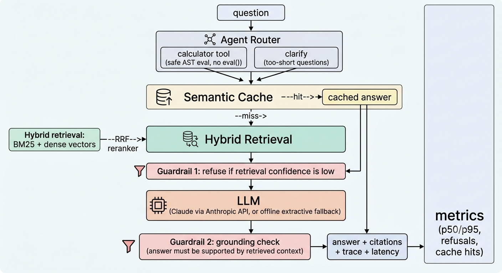

# DocPilot

A **RAG agent over technical documentation** with hybrid retrieval, a tool-using agent, hallucination guardrails, a semantic cache, and an **automated evaluation harness that can fail CI** when quality drops. Ships with Docker, Kubernetes manifests, and a GitHub Actions pipeline.

> Most RAG demos stop at "it answers questions." DocPilot also measures *how well* it answers, refuses out-of-scope questions, and documents where it still fails.

## Architecture

```

```

## Evaluation results

Run with `python evals/run_evals.py`. Full numbers are in [`docpilot_eval_results.xlsx`](docpilot_eval_results.xlsx).

**Run 2: semantic embeddings** (`DOCPILOT_EMBEDDER=st`, all-MiniLM-L6-v2). 19 questions: 16 answerable, including 3 paraphrased questions that reuse none of the doc's wording, plus 3 out-of-scope.

| Retrieval strategy | Hit@3 | MRR | Avg latency (ms) |
|---|---|---|---|
| BM25 (keyword) | 0.94 | 0.94 | 8.89 |
| Dense (embeddings) | 1.00 | 1.00 | 9.43 |
| Hybrid (RRF) | 1.00 | 0.97 | 9.77 |
| Hybrid + rerank | 0.94 | 0.94 | 9.44 |

| End-to-end metric | Score |
|---|---|
| Answer rate (answerable questions) | 0.88 |
| Grounded answers | 1.00 |
| Refusal accuracy (out-of-scope questions) | 1.00 |

Semantic cache: 26.7 ms cold to 11.7 ms warm average per request.

### What the results show (and don't)

- **Keyword search missed a paraphrased question that embeddings found** (Hit@3 0.94 vs 1.00). That is a one-question difference on a small set, so it is directional, not proof.
- **Retrieval is better than the guardrail.** The right chunk is retrieved, but the refusal check (word overlap between question and chunk) still wrongly refused about 2 of 16 answerable questions, so the answer rate is 0.88. The reranker is also lexical, which is why it scored below dense and hybrid on paraphrased questions.
- **"Grounded 1.00" is weak evidence.** The offline LLM copies sentences from the context, so grounding is high by construction. Set `ANTHROPIC_API_KEY` to evaluate real generation.
- An earlier run with the offline `hash` embedder scored 1.00 everywhere on 13 answerable questions, after one doc paragraph was reworded to match a test question. That says little about quality, so Run 2 is the one to trust.

### Known issues and next steps
1. Replace the lexical refusal check and reranker with embedding-similarity versions when `embedder=st`, then re-run and record the answer-rate change.
2. Grow the doc set (30 to 50 real pages) and the golden set (about 50 questions, mostly paraphrased).
3. Add LLM-as-judge faithfulness scoring and a cross-encoder reranker.
4. Persistent vector store (pgvector or Qdrant), auth, rate limiting, streaming responses.

## Quickstart

```bash
python -m venv .venv
# Windows: .venv\Scripts\Activate.ps1      macOS/Linux: source .venv/bin/activate
pip install -r requirements-dev.txt
python -m pytest -q
python evals/run_evals.py
python -m uvicorn app.main:app --reload     # open http://127.0.0.1:8000/docs
```

Try it:

```bash
curl -s localhost:8000/ask -H "content-type: application/json" \
  -d '{"question": "How do I roll back a bad release?"}'
```

### Better embeddings (optional)

```bash
pip install sentence-transformers
# PowerShell: $env:DOCPILOT_EMBEDDER="st"      bash: export DOCPILOT_EMBEDDER=st
python evals/run_evals.py
```

**Windows tips**
- Use a virtual environment with a short path (for example `python -m venv C:\dpenv`). The Microsoft Store Python installs packages under very long paths, and large packages like PyTorch can fail with `WinError 206`.
- If PowerShell blocks `Activate.ps1`, choose "Run once" at the prompt or run `Set-ExecutionPolicy -Scope CurrentUser RemoteSigned`.
- Run tools through Python (`python -m pytest`, `python -m uvicorn`) if the commands are not on PATH.

### Docker and Kubernetes

```bash
docker compose up --build
kubectl apply -f k8s/deployment.yaml
```

Use your own docs: drop `.md` files into `data/docs/` and restart.

## Configuration

| Env var | Default | Purpose |
|---|---|---|
| `ANTHROPIC_API_KEY` | unset | Enables the Claude backend (otherwise offline extractive mode) |
| `DOCPILOT_MODEL` | `claude-sonnet-4-6` | Model used for generation |
| `DOCPILOT_EMBEDDER` | `hash` | `st` for sentence-transformers embeddings |
| `DOCPILOT_MIN_COVERAGE` | `0.34` | Retrieval-confidence threshold for refusing |
| `DOCPILOT_CACHE_THRESHOLD` | `0.9` | Similarity needed for a cache hit |

## Design decisions and trade-offs

- **RRF over score blending:** BM25 and cosine scores sit on different scales; rank fusion needs no tuning.
- **Refuse early:** a retrieval-confidence gate stops the LLM from improvising on out-of-scope questions (cheaper and safer), at the cost of occasional false refusals on paraphrases (see results).
- **Offline-first:** the full pipeline, tests, and CI run with no API keys, so every commit is verifiable.
- **Eval as a CI gate:** `evals/run_evals.py` exits non-zero when Hit@3 or refusal accuracy fall below thresholds.
- **Safe calculator tool:** arithmetic is parsed with `ast` and a whitelist of operators; no names, calls, or attribute access.

## Project layout

```
app/        core pipeline: ingest, retrieval, cache, guardrails, llm, agent, FastAPI app
evals/      golden_set.jsonl + run_evals.py (writes results.md)
tests/      unit tests
k8s/        Deployment and Service manifests
.github/    CI: tests, quality gate, docker build
docpilot_eval_results.xlsx   eval numbers with formulas and caveats
```
